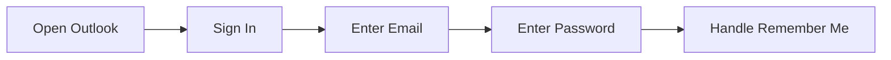
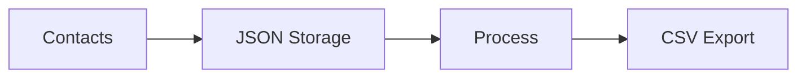
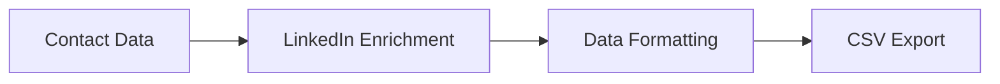

# Outlook LinkedIn Contact Enrichment Tool 🔄

## Overview
An automated tool for enriching Outlook contacts with LinkedIn profile data, featuring robust error handling, rate limiting, and persistent state management.

## 🔄 Operational Flow

### 1. Configuration & Setup 🛠️
```python
# Configuration Loading
- Load credentials from access.txt
- Configure proxy settings (if any)
- Initialize Chrome WebDriver
- Set up utility classes
```

### 2. Authentication Process 🔐


### 3. Contact Data Collection 📋

#### Primary Method: FindPeople Endpoint
```python
while monitoring_requests:
    if request.contains("FindPeople"):
        collect_contacts(batch_size=500)
        update_progress()
```

#### Fallback: Contacts Endpoint
```python
if findPeople_results.empty:
    fetch_direct_contacts()
```

### 4. LinkedIn Profile Extraction 👥

```python
for contact in contacts:
    # Generate LinkedIn request template
    template = click_first_contact()
    
    # Extract authentication
    tokens = get_auth_tokens()
    
    # Fetch profile data
    profile = fetch_linkedin_profile(contact, tokens)
    
    # Process data
    processed_data = extract_profile_info(profile)
```

### 5. Data Management Strategy 💾

#### File Structure
```
├── {email}_lastIndex    # Progress tracking
├── allContacts.json     # Contact storage
└── {email}_export.csv   # Final export
```

#### Data Flow


### 6. Protection Mechanisms 🛡️

#### Rate Limiting
- ⏰ 6-second delay between LinkedIn requests
- 🔄 9-hour pause after 500 contacts
- ⚠️ 24-hour wait on 424 errors
- 🔁 2-minute retry on 500 errors

#### Error Handling
```python
try:
    process_contact()
except ForbiddenError:
    wait_hours(24)
except ServerError:
    wait_minutes(2)
except CriticalError:
    notify_developer()
```

### 7. Data Processing Pipeline 🔄



## 📊 CSV Structure
- Email
- Display Name
- First Name
- Last Name
- Phone Numbers
- Headline
- Location
- Education History
- Work History
- LinkedIn URL

## 🚀 Key Features

- ♻️ Robust error handling and recovery
- 🔒 Rate limiting protection
- 💾 Persistent state management
- 📝 Comprehensive logging
- 🔄 Resume capability
- 📊 Data enrichment
- 🎯 Modular design

## ⚠️ Important Notes

1. Respect rate limits to avoid API blocks
2. Monitor WhatsApp alerts for critical errors
3. Regular backups of progress files recommended
4. Check proxy configuration if using